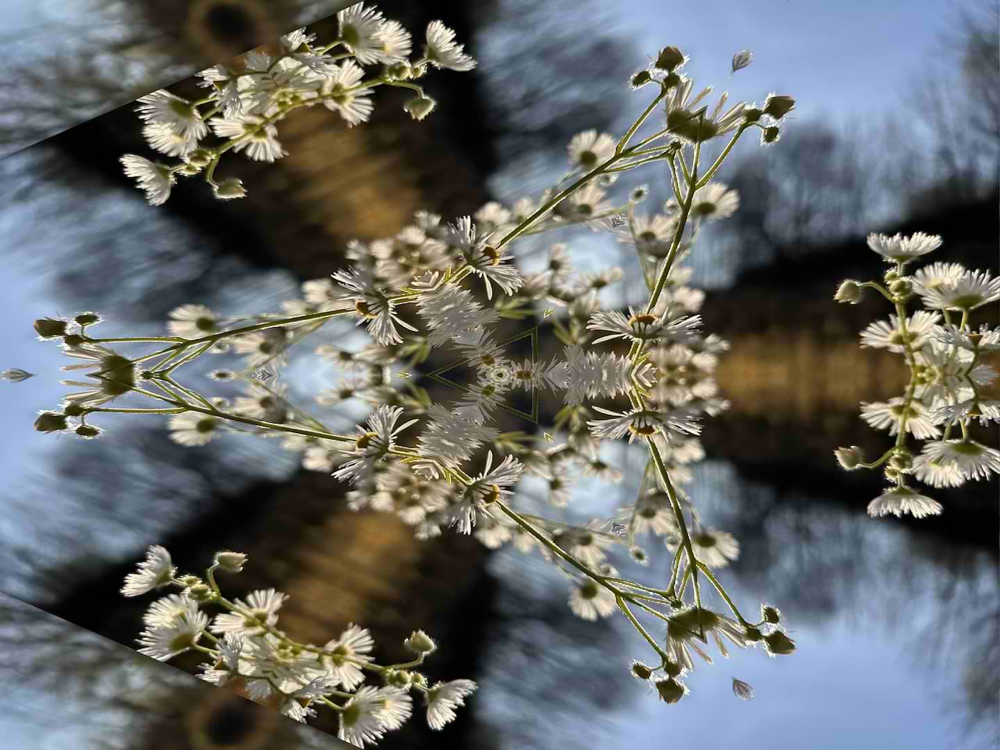
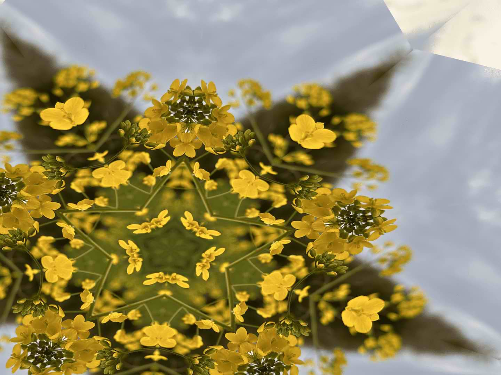
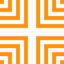
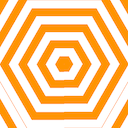
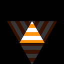
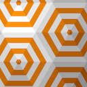
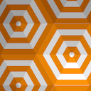

# Kaleidoscope Engine

Library for iOS and macOS providing kaleidoscope effects to images and videos.

A kaleidoscope shows a symetric pattern as a result of repeated reflections between two or more mirrors. Kaleidoscope Engine provides methods for a kaleidoscope with a varying number of mirrors (“Kaleidoscope”) and three mirrors arranged in a triangle (“Triangle Kaleidoscope”).



Please try the [demo application](Demo) for iOS and macOS.

## Table of contents

- [Installation](#installation)
- [Usage](#usage)
    - [Applying kaleidoscope effects to images](#applying-kaleidoscope-effects-to-images)
    - [Applying kaleidoscope effects to videos](#applying-kaleidoscope-effects-to-videos)
- [Kaleidoscope kinds](#kaleidoscope-kinds)
    - [Kaleidoscope](#kaleidoscope)
    - [Triangle kaleidoscope](#triangle-kaleidoscope)
- [Video Kaleidoscope Engine](#video-kaleidoscope-engine)
    - [Video framerate](#video-framerate)
    - [Concurrent frame processing](#concurrent-frame-processing)
- [Testing](#testing)
    - [Writing new tests](#writing-new-tests)
- [Contributing](#contributing)

## Installation

To use this package in a SwiftPM project, you need to set it up as a package dependency:

```swift
// swift-tools-version:5.9
import PackageDescription

let package = Package(
  name: "MyPackage",
  dependencies: [
    .package(
      url: "https://github.com/Eskils/KaleidoscopeEngine", 
      .upToNextMinor(from: "1.0.0") // or `.upToNextMajor
    )
  ],
  targets: [
    .target(
      name: "MyTarget",
      dependencies: [
        .product(name: "KaleidoscopeEngine", package: "KaleidoscopeEngine")
        // For video-support:  .product(name: "VideoKaleidoscopeEngine", package: "KaleidoscopeEngine") 
      ]
    )
  ]
)
```

## Usage

Kaleidoscope Engine works by applying a kaleidoscope effect on an image or video. The effects are written as compute shaders in Metal.

There are separate libraries for image and video support.

- **KaleidoscopeEngine** is for images, and
- **VideoKaleidoscopeEngine** is for videos/movies.

VideoKaleidoscopeEngine depends on KaleidoscopeEngine internally.

The available kaleidoscope effects are:

- [Kaleidoscope](#kaleidoscope)
- [TriangleKaleidoscope](#triangle-kaleidoscope)

### Applying kaleidoscope effects to images

Kaleidoscope Engine works on **CGImage**.

Example usage:

```swift
import KaleidoscopeEngine

// ...

let kaleidoscopeEngine = KaleidoscopeEngine()

kaleidoscopeEngine.kaleidoscope(
    image:      inputCGImage,
    count:      count,
    angle:      angle,
    position:   position,
    fillMode:   fillMode
)
```

See [Kaleidoscope kinds](#kaleidoscope-kinds) for an overview of the various kaleidoscope effects available.

### Applying kaleidoscope effects to videos

Video Kaleidoscope Engine works on **URL**. The url provided is fed to an AVAsset internally.

All methods in the Video Kaleidoscope Engine has the same parameters as its corresponding method in Kaleidoscope Engine, and additionally:
    - outputURL: The resulting video is written to disk, and so an output url is required.
    - progressHandler: Block to handle progress and whether to continue.
    - completionHandler: Block to handle completion and errors.

Example usage:

```swift
import VideoKaleidoscopeEngine

// ...

let videoKaleidoscopeEngine = VideoKaleidoscopeEngine(frameRate: 30)

videoKaleidoscopeEngine.kaleidoscope(
    video:              videoURL,
    outputURL:          outputURL,
    count:              count,
    angle:              angle,
    position:           position,
    fillMode:           fillMode,
    progressHandler:    progressHandler,
    completionHandler:  completionHandler
)
```

## Kaleidoscope Kinds

Here is an overview of the available kaleidoscope effects.

### Kaleidoscope

Kaleidoscope is the familiar look of a physical kaleidoscope with two or more mirrors. The number of mirrors can be varied, as well as the rotation of the kaleidoscope, center of reflection, and how to fill where the kaleidoscope effect would be blank.



Code name: `.kaleidoscope`

**Configurable properties**

#### Count

| Name | Type | Default | Description |
|------|------|---------|-------------|
| Count | Float | 3 | The number of mirrors | 

Example values: 
| 3 | 4 | 5 |
|---|---|---|
 |  |  |

#### Angle 

| Name | Type | Default | Description |
|------|------|---------|-------------|
| Angle | Float | 0 | The rotation of the kaleidoscope | 

> **NOTE:** Angle is expected in radians. 

Example values: 
| 0° | 15° | 90° | 120° |
|---|---|---|---|
 |  |  |  |

#### Position

| Name | Type | Default | Description |
|------|------|---------|-------------|
| Position | CGPoint | (0.5, 0.5) | The center of reflection | 

> **NOTE:** The position is in normalized coordinates. I.e. (1, 1) = (width, height)

Example values: 
| (0.5, 0.5) | (0.2, 0.2) | (0.8, 0.8) |
|---|---|---|
 |  |  |

#### Tile Mode

| Name | Type | Default | Description |
|------|------|---------|-------------|
| Tile Mode | TileMode | `.tile` | How to fill where the kaleidoscope effect would be blank | 

Possible values: 
| `.tile` | `.blank` |
|---|---|
 |  |

### Triangle Kaleidoscope

Triangle Kaleidoscope is the look of a kaleidoscope with three mirrors arranged in a triangle. This kaleidoscope effect gives a symetric reflection of equilateral triangles.


Code name: `.triangleKaleidoscope`

**Configurable properties**

#### Size

| Name | Type | Default | Description |
|------|------|---------|-------------|
| Size | Float | 200 | The length of each mirror / size of the triangle to reflct | 

Example values: 
| 200 | 100 | 300 |
|---|---|---|
 |  |  |

#### Decay

| Name | Type | Default | Description |
|------|------|---------|-------------|
| Decay | Float | 0 | How much each reflection decreases in brightness | 

> **NOTE:** Decay is expected to be between 0 to 1, where 0 is no decay and 1 is full decay — i.e. only the center triangle shows.

Example values: 
| 0 | 0.1 | 0.75 |
|---|---|---|
 |  |  |

#### Position

| Name | Type | Default | Description |
|------|------|---------|-------------|
| Position | CGPoint | (0.5, 0.5) | The center of reflection | 

> **NOTE:** The position is in normalized coordinates. I.e. (1, 1) = (width, height)

Example values: 
| (0.5, 0.5) | (0.2, 0.2) | (0.8, 0.8) |
|---|---|---|
 |  |  |

> The example values are shown with decay = 0.2 to indicate the differences more clearly.

## Video Kaleidoscope Engine

Video Kaleidoscope Engine is a separate library included in the KaleidoscopeEngine package for adding kaleidoscope effects to videos/movies. Video Kaleidoscope Engine works by applying a kaleidoscope effect to each frame in the video.

Example usage:

```swift
import VideoKaleidoscopeEngine

// ...

let videoKaleidoscopeEngine = VideoKaleidoscopeEngine(frameRate: 30)

videoKaleidoscopeEngine.kaleidoscope(
    video:              videoURL,
    outputURL:          outputURL,
    count:              count,
    angle:              angle,
    position:           position,
    fillMode:           fillMode,
    progressHandler:    progressHandler,
    completionHandler:  completionHandler
)
```

### Video framerate

By default, the final video has a framerate of 30. You may adjust the final framerate by providing a frame rate when initializing Video Kaleidoscope Engine. The final frame rate is less than or equal to the specified value.:
```swift
VideoKaleidoscopeEngine(frameRate: Int)
```

### Concurrent frame processing

By default, video frames are rendered concurrently. You can disable this behaviour, or change the number of frames processed simultaneously using the `numberOfConcurrentFrames` property. 

Setting this to 1 will effectively disable concurrent frame processing. A higher number will be faster if the CPU has enough cores to handle the load, but will also use more memory.

## Testing

The tests work by checking if the image produced by the code look the same to expected output images. To save space, the expected output images are not bundled with the package. 

The expected images can be generated by running the `MakeExpectedImagesForTests` scheme. 

### Writing new tests

When writing new tests, you start by adding configuration to produce the expected image for your test, then writing the test. 

The tests are mainly written using `isEqual(expectedImageName: String, afterPerformingImageOperations block: (CGImage) throws -> CGImage) throws -> Bool`

Each expected image is described in the *ke-tests-configuration.json* file. This configuration provides details such as which image to use as input, where to output, and which transforms to apply to the input image. Each transform consists of a kind and a configuration that suits its kind.

Extract of *ke-tests-configuration.json*:
```json
{
	"input": "./Inputs/lines.png",
	"output": "./ExpectedOutputs",
    "clearOutputDirectory": true,
	"transforms": [
		{
			"kind": "kaleidoscope",
			"configuration": {
				"count": 1,
                "angle": 0,
				"fillMode": "tile"
			}
		},
        ...
    ]
}
```

Kaleidoscope transform:
```json
{
    "kind": "kaleidoscope",
    "configuration": {
        "count": 3,
        "angle": 0,
        "fillMode": "tile"
    }
}
```

Triangle kaleidoscope transform:
```json
{
    "kind": "triangleKaleidoscope",
    "configuration": {
        "size": 200,
        "decay": 0.2
    }
}
```

## Contributing

Contributions are welcome and encouraged. Feel free to check out the project, submit issues and code patches.